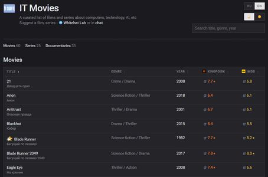

## 🎥 IT Movies
- - -



> A curated list of films and series about computers, technology, artificial intelligence, etc

⭐️ Suggest a film, series - [Whitehat Lab](https://t.me/wh_lab), [chat](https://t.me/whitehat_chat) or [issues](https://github.com/akhomlyuk/IT_movies/issues)

## 🚀 Run locally

Static site, no build step required:

```bash
python -m http.server 8000
# then open http://localhost:8000
```

Or just serve the repo root with any static file server (e.g. `npx serve`).

## 📁 Structure

- `index.html` — main page (Vue 3 catalog); the theme head-script, the static JSON-LD and the no-JS catalog block are injected by `tools/gen_pages.py`
- `films/<imdbId>/index.html` — a static SEO page per film/series (hybrid slug `<id>-<title-en-slug>`, fallback id `kp-<kpId>` when no imdbId); each embeds its record as `window.FILM_PAGE` and shares the main page's styles, language switch and theme toggle via `js/film.js`
- `404.html` — GitHub Pages 404 page with built-in RU/EN switch
- `js/data.js` — full catalog including descriptions (`js/catalog.js` = the same data without `desc`, generated by `tools/gen_pages.py` so the main page doesn't ship dead ~225 KB)
- `js/common.js` — shared helpers (slug/URL builders, lang/theme resolution, rating formatting, error handler) used by `js/app.js` and `js/film.js`; pages load the generated `js/*.min.js` copies
- `robots.txt`, `sitemap.xml` — SEO (regenerated by `tools/verify.py` from the single `SITE_BASE` when stale, `--no-write` for check-only; indexes home page + all film pages, hreflang ru/en/x-default alternates)
- `tools/lib.py` — shared helpers for the scripts below
- `tools/verify.py` — data/site integrity checker (source of truth, end with `✅ All good`; also checks generated pages are fresh)
- `tools/gen_pages.py` — generates `films/*` pages + `js/catalog.js` + `js/*.min.js` from `js/data.js` and `js/i18n.js`, injects the theme/no-JS blocks into `index.html` and `404.html`
- `tools/smoke.js` — node smoke harnesses (app.js / slug parity / film.js / related parity) driven by `tools/verify.py`
- `tools/pw_kp.py` — Kinopoisk search + rating lookup via Playwright (kpId, kpRating)
- `tools/show_types.py` — prints every catalog record with its source line number

## Copyright & Posters

The site's code (HTML/CSS/JS, Python scripts) is released under the [MIT License](LICENSE).

Film posters displayed on the site (`static/posters/*.webp`) belong to their respective copyright holders (film studios, Kinopoisk, IMDb, etc.) and are used for identification and reference purposes only — they are not covered by the MIT license. If you are a rights holder and would like an image removed, please open an [issue](https://github.com/akhomlyuk/IT_movies/issues) or contact us.
